# 7nm FinFET Asynchronous Dynamic Comparator IP

## Introduction

This repository contains the design, simulation, and characterization of a comparator using the ASAP7 7nm FinFET Process Design Kit (PDK). The comparator is a crucial component in various analog and mixed-signal systems, including Analog-to-Digital Converters (ADCs), where it is used to compare two input voltages and generate a digital output.

The design leverages the ASAP7 FinFET technology, offering advantages in power efficiency and speed at advanced nodes. The comparator has been thoroughly simulated for pre-layout and post-layout characteristics using industry-standard tools like **Xschem** for schematic capture, **NGSpice** for circuit simulation.

Key features of this project include:
- Utilization of the ASAP7 7nm PDK for FinFET-based transistor design.
- A focus on low-power, high-speed analog comparator design.
- Comprehensive simulation results, including DC, transient, and noise analysis.
- Detailed characterization of pre-layout performance.

## Design Specifications

| Parameter    | Description                          | Value   | Unit |
|--------------|--------------------------------------|---------|------|
| VDD          | Supply Voltage                       | 0.7     | V    |
| ΔV           | Hysteresis (V_Rise - V_Fall)         | 52      | mV   |
| V_IL         | Input Low Voltage                    | 0       | V    |
| V_IH         | Input High Voltage                   | 26      | mV   |
| V_OL         | Output Low Voltage                   | 0       | V    |
| V_OH         | Output High Voltage                  | 650     | mV   |

## Related Repositories

[ASAP7_FinFET_Inverter_Characterization](https://github.com/shaurya0406/ASAP7_FinFET_Inverter_Characterization.git)

## Reference Design

    
Reference Design

The comparator circuit design implemented in this project is based on the architecture described in the paper by **TSAI et al.**, titled: *"A 0.003 mm² 10-bit 240 MS/s 0.7 mW SAR ADC in 28 nm CMOS with Digital Error Correction and Correlated-Reversed Switching."* This architecture serves as a foundational reference for high-performance, energy-efficient designs in deep-submicron technologies.
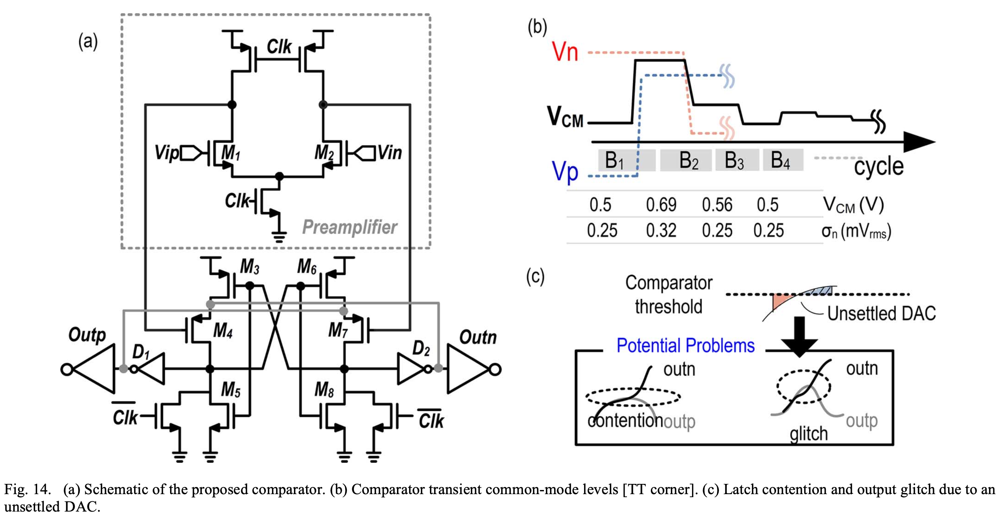
#### Strong Arm Latch / Dynamic Comparator

The **Strong Arm Latch**, also known as a dynamic comparator, is a popular architecture for high-speed, low-power comparators, often used in Analog-to-Digital Converters (ADCs). This design operates in two distinct phases: reset and evaluation. During the reset phase, the circuit is precharged, and during the evaluation phase, the input differential voltage is amplified, determining the output state.

**Key characteristics of the Strong Arm Latch**:
- **Dynamic operation**: It only consumes dynamic power during the transition between the reset and evaluation phases, making it highly power-efficient.
- **High speed**: Due to its dynamic nature, the Strong Arm Latch achieves very fast response times, suitable for high-speed ADCs.
- **Low offset**: The architecture inherently reduces the mismatch-induced offset, which is critical in precision comparators.
- **Small area**: Its compact design allows it to be integrated efficiently, making it ideal for dense circuits like those found in advanced nodes (28nm CMOS in the reference design, 7nm in this work).

In this project, we adapt this Strong Arm Latch architecture using the ASAP7 FinFET technology for improved performance metrics at the 7nm scale, ensuring lower power consumption and faster switching speeds than traditional CMOS designs.

**To break down the comparator design into two parts**:

1. **Pre-Amplifier Stage**: 
   The pre-amplifier is responsible for amplifying the small differential input voltage before the signal reaches the latch. It helps reduce the input-referred offset by increasing the gain. Typically, this stage uses FET transistors to amplify the difference between the input voltages.

2. **Regenerative Latch**:
   The regenerative latch functions as a bistable element that stores the amplified input signal and converts it into a full-scale digital output. This stage employs positive feedback, ensuring rapid switching between two stable states based on the pre-amplified differential input.

These stages work together to amplify weak signals and quickly produce a sharp output.

## Design Process

The circuit was designed using ASAP7 FET Models based on BSIM CMG in Xschem.

### V1

    
Schematic_V1

**Schematic_V1** [File](xschem/src/comparator.sch)
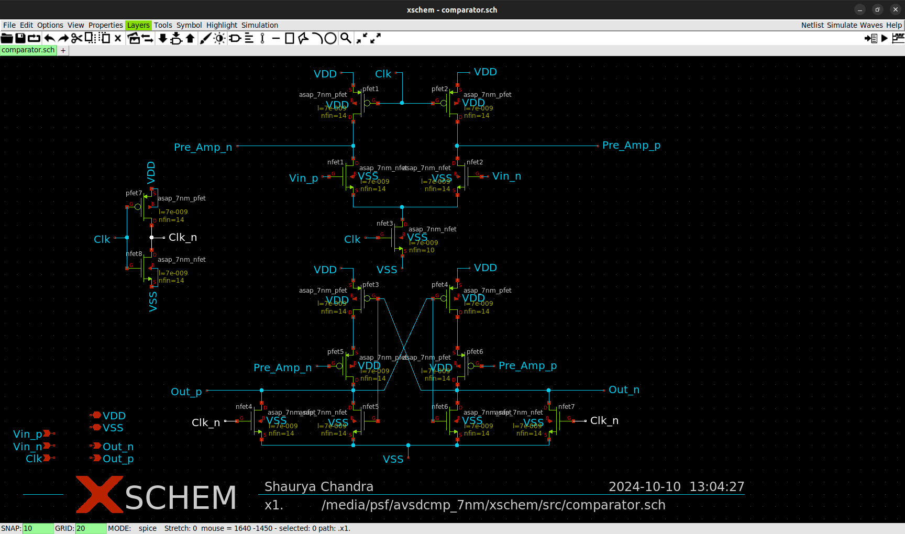

    
Symbol_V1

**Symbol_V1** [File](xschem/src/comparator.sym)
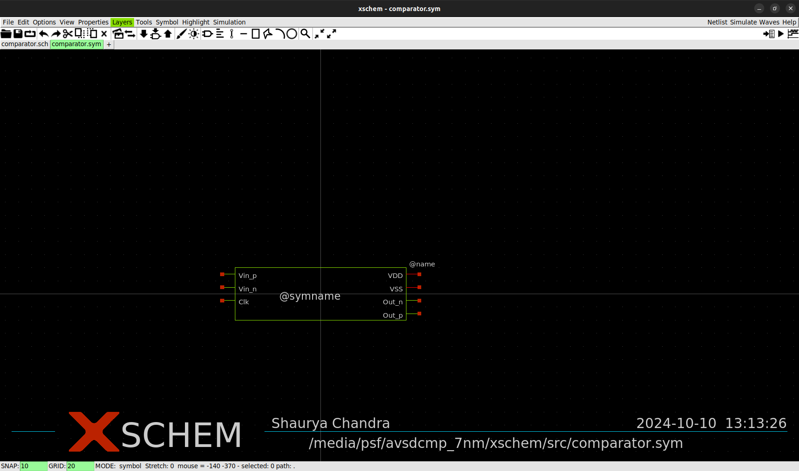

    
Testbench_V1

**Testbench_V1** [File](xschem/test/comparator_test.sch)
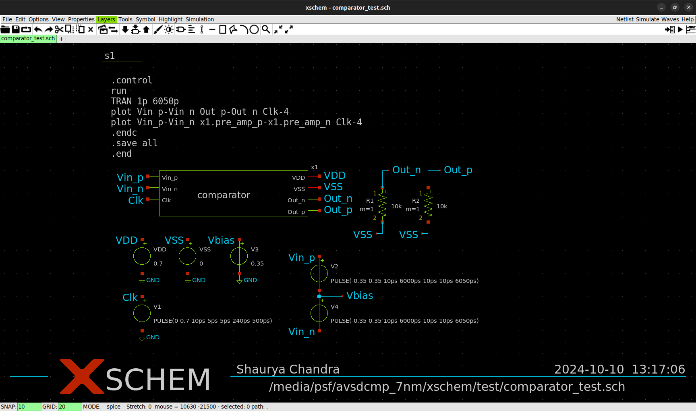

    
SPICE_V1

**SPICE_V1** [File](xschem/spice/comparator_test.spice)

**Pre Amplifier Output**

**Regenerative Latch Output**
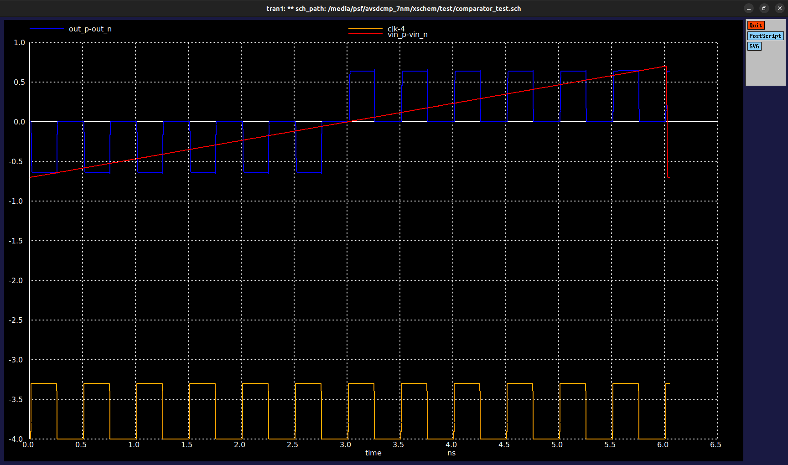

    
SPICE_V1 Analysis

- In SpiceV1, all the FETs are sized with 14 fins.
- In the PreAmp stage, the output signal is distorted and never settles while the clock is high.
- In the Regenerative phase, the final comparator output is latched to correct logic i.e. low when `Vin_n` < `Vin_p` and vice versa but never reaches -0.7V or +0.7V, although the noise margin for FinFET based inverter is approximately 0.2V, so it can work, but we will try to improve this.

**Techniques:**
1. Downsize transistors
2. Strengthen the clock signal by adding a buffer or pre-driver stage
3. Reassess the capacitances in the circuit, particularly at the output nodes.
4. Reducing the clock speed

### V2

    
Schematic_V2

**Schematic_V1** [File](xschem/src/comparator.sch)
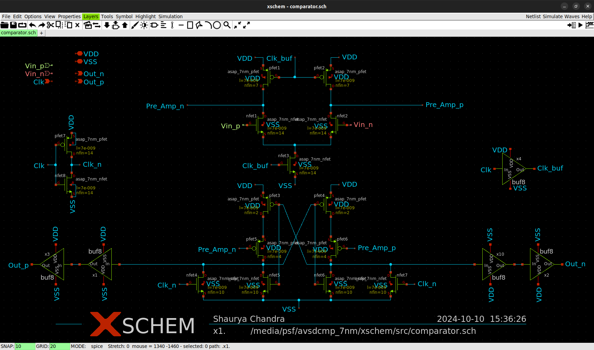

    
Testbench_V2

**Testbench_V1** [File](xschem/test/comparator_test.sch)
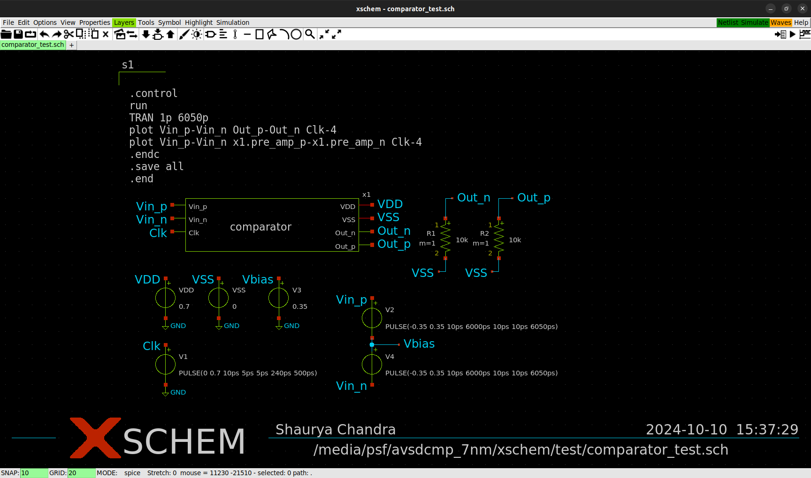

    
SPICE_V2

**SPICE_V1** [File](xschem/spice/comparator_test.spice)

**Pre Amplifier Output**

**Regenerative Latch Output**

    
SPICE_V2 Analysis

- Clk Period: 500ps
- In the PreAmp stage, the output signal never settles for a long time but produces high enough gain for the next stage. FETs are downsized. PFET's parasitic capacitance is reduced by downsizing and clock is made more robust by adding a large size buffer
- `Clk_n` is not changed as the inverter is of a large size and hence gives good output drive.
- In the Regenerative phase, the final comparator output is bufferred to ensure it reaches VDD in both directions.
- Overall, comparator works well for a slow rising input, and gives an output of 0.65V instead of 0.7V, which is improvement over V1 (0.6V)

    
Testbench_V2_Triangular Pulse

**Testbench_V2_Triangular Pulse** [File](xschem/test/comparator_test_triangular_input.sch)
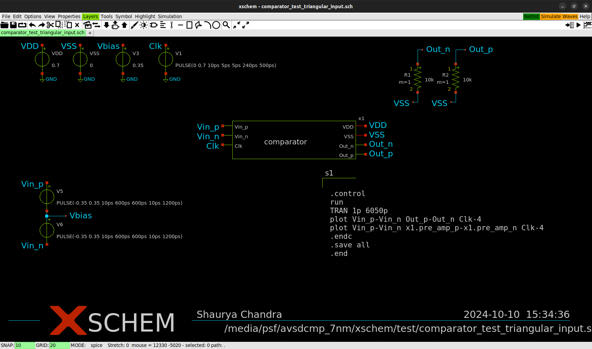

    
SPICE_V2_Triangular Pulse

**SPICE_V2_Triangular Pulse** [File](xschem/spice/comparator_test_triangular_input.spice)

**Pre Amplifier Output**
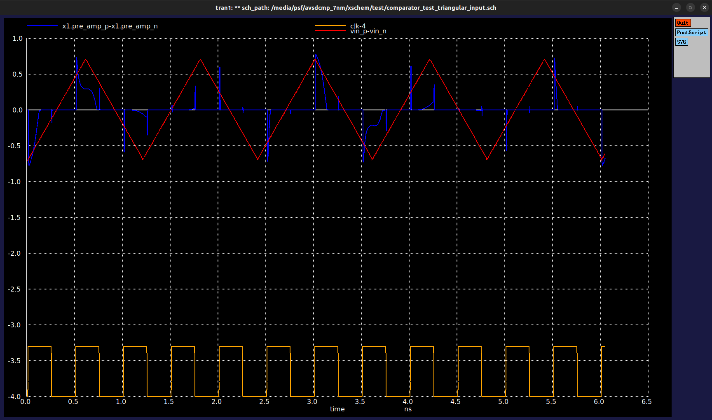
**Regenerative Latch Output**
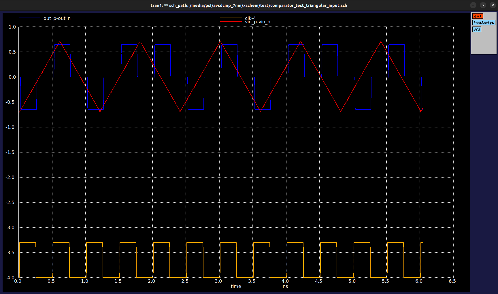

## Characterization

    
Hysteresis

### Hysteresis
When the difference between two analog input signals approach zero, noise on the inputs will cause spurious switching of digital output. This rapid change in output due to noise can be prevented by hysteresis. 
Hysteresis is switching the output high or low at different input signal levels. 
In place of one switching point, hysteresis introduces two: one for rising edge, and one for falling edge of voltage or current. 
The difference between the higher-level trip value (VRise) and the lower-level trip value (VFall) equals the hysteresis voltage (HYST).

**Spice file**
[comparator_test_single_mode](xschem/spice/comparator_test_single_mode.spice)

**VRise**
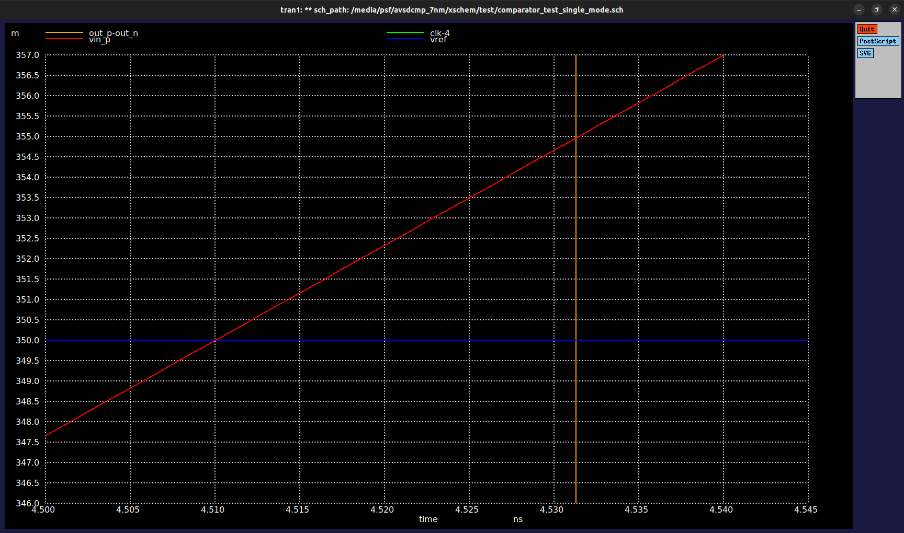

**VFall**
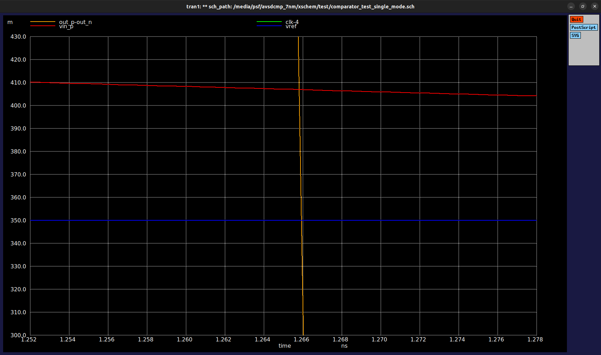

    
Voh

### Voh

**Spice file**
[comparator_test](xschem/spice/comparator_test.spice)

**Output**
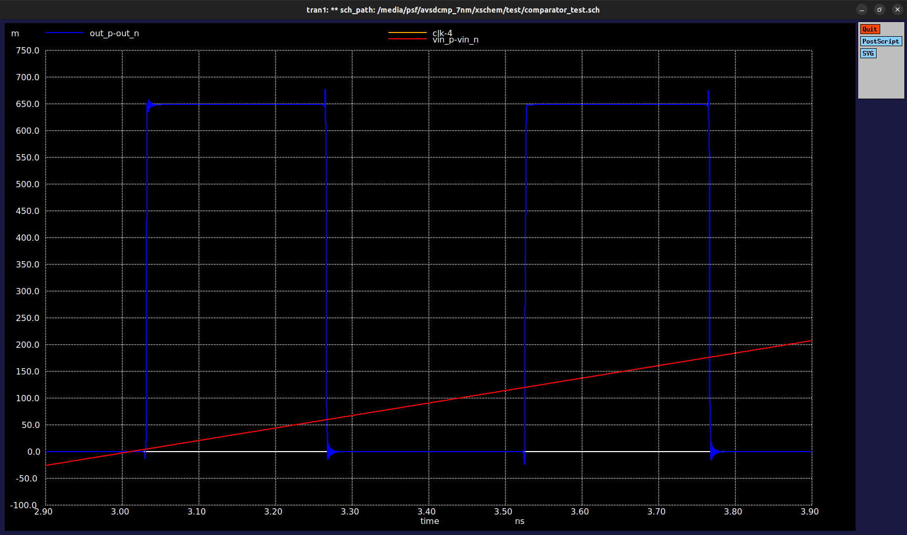

## Acknowledgement

- [Kunal Ghosh](www.linkedin.com/in/kunal-ghosh-vlsisystemdesign-com-28084836), Co-Founder of VLSI System Design (VSD) Corp. Pvt. Ltd. 
- [Dr. Skandha Deepsita](www.linkedin.com/in/dr-skandha-deepsita-s-027433ba), Teaching Assistant, VLSI System Design (VSD) Corp. Pvt. Ltd.
- [Jossan Eleazar B](www.linkedin.com/in/jossan-eleazar-b-79809a25a), Ex- ASIC engineer at Meister-gen Technologies